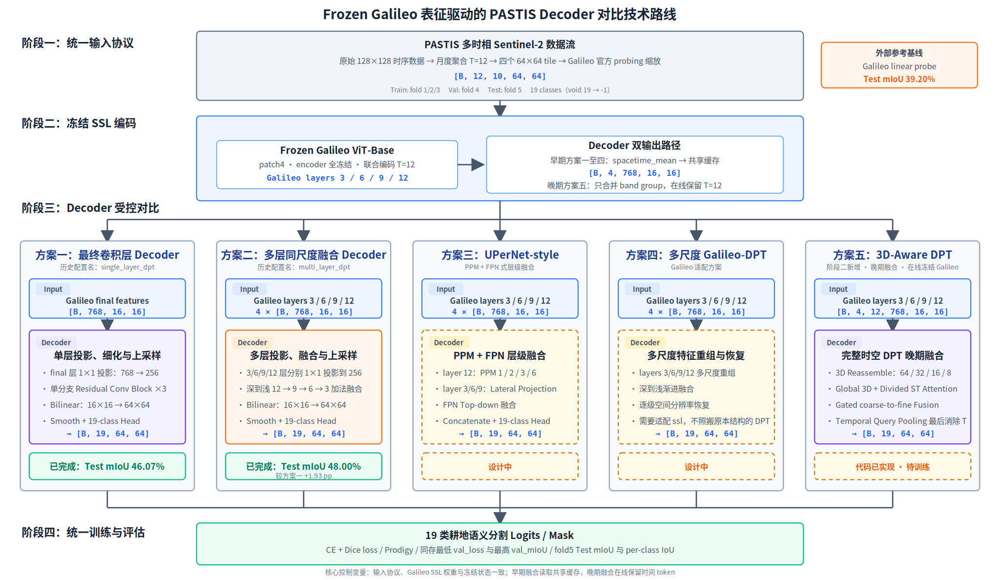

# PreSSL-CropSeg

本项目研究 **frozen Galileo 遥感自监督表征在 PASTIS 作物语义分割上的迁移能力**。

当前实验固定同一个 Galileo encoder、输入协议和冻结策略，对比早期与晚期融合 decoder：

```text
PASTIS Sentinel-2 time series
  -> Galileo 论文输入协议
  -> frozen Galileo encoder
  -> early fusion: spacetime_mean shared cache
  -> late fusion: online per-month hidden grids
  -> convolution / multi-layer / UPerNet / Galileo-DPT / 3D-Aware DPT
  -> 19-class semantic segmentation logits
```

现有 `single_layer_dpt` 与 `multi_layer_dpt` 是历史配置名，实际分别为最终层卷积 baseline 和多层同尺度融合 baseline，均不是完整 DPT。方案一至四在 decoder 前对时间 token 求均值并读取同一版缓存；方案五 `3d_aware_dpt` 使用同一冻结 Galileo 在线提取四层逐月特征，在完整 3D DPT 多尺度融合后才消除时间维。

## 技术路线图



可编辑 SVG 源码：[pictures/project_technical_route.svg](pictures/project_technical_route.svg)。图中没有已经撤销的 paper-faithful DPT；第五列是阶段二新增的 3D-Aware DPT 晚期融合方案。

## 当前实现

已经支持：

- Galileo 论文 PASTIS split 与输入协议
- 最终层卷积 decoder（历史配置名 `single_layer_dpt`）
- 多层同尺度融合 decoder（历史配置名 `multi_layer_dpt`）
- Galileo-Adapted 2D DPT（四级 learned reassemble + 渐进融合）
- UPerNet-style decoder（PPM + FPN）
- 3D-Aware DPT：3D Reassemble、全局/分解时空注意力、门控多尺度融合与时间查询池化
- 多层 Galileo 特征共享缓存
- 冻结 Galileo 在线训练与梯度累积
- cached feature 训练与评估
- Galileo 论文式线性探测与学习率搜索
- 与 decoder 实验同训练协议的线性 head 对照
- 基于 fold4 `val_mIoU` 的可配置早停
- TensorBoard loss / val mIoU 日志

待完成实验：

- Galileo-Adapted 2D DPT、UPerNet-style 与 3D-Aware DPT 的正式训练、测试和多 seed 复验
- 结果和研究结论只在训练完成后补充

详细实验定义见 [docs/DECODER_EXPERIMENTS.md](docs/DECODER_EXPERIMENTS.md)。两个既有 baseline 的首轮结果见 [docs/PROGRESS_REPORT_2026-07-11.md](docs/PROGRESS_REPORT_2026-07-11.md)；加入线性 head 并统一按最高 val mIoU 重测后的报告见 [docs/PROGRESS_REPORT_2026-07-13_LINEAR_COMPARISON.md](docs/PROGRESS_REPORT_2026-07-13_LINEAR_COMPARISON.md)。

## 数据与权重

PASTIS 放在：

```text
data/PASTIS/
  metadata.geojson
  DATA_S2/S2_*.npy
  ANNOTATIONS/TARGET_*.npy
```

Galileo Hugging Face 权重放在：

```text
pretrained/galileo-base-patch8/
  config.json
  model.safetensors
  modeling_galileo.py
  processing_galileo.py
  preprocessor_config.json
```

以下大文件目录保持 Git 忽略，不会上传：

```text
data/PASTIS/
data/cache/
pretrained/
.hf_cache/
logs/
checkpoints/
__pycache__/
```

## 论文输入协议

Galileo 官方论文和仓库中的 PASTIS 设置为：

```text
train: fold1 + fold2 + fold3
val:   fold4
test:  fold5

原图:          [T, 10, 128, 128]
月度聚合后:    [12, 10, 128, 128]
空间切块后:    [12, 10, 64, 64]，每张原图生成4个样本
Galileo patch: 4
特征图:        [D, 16, 16]
有效类别:      0..18，共19类
void label:    原始19 -> -1，在 loss 和 mIoU 中忽略
```

当前 raw PASTIS 转换规则：

1. 去掉首尾不完整月份，取 `2018-10` 到 `2019-09` 的12个月作物年。
2. 同月多个 Sentinel-2 观测逐像素取均值。
3. 个别区域缺少 `2018-12`，使用相邻月线性插值。
4. 每个 `128x128` 样本按行优先切成四个 `64x64` 子块。
5. 使用 Galileo 官方 probing 的 `OURS + norm_no_clip + std_multiplier=2.0` 缩放。
6. 数据已完成官方缩放，因此 HF processor 设置 `encoder.normalize=false`，避免二次归一化。

官方评测数据类读取预生成的 `(N, 12, 13, 64, 64)` 张量。13波段包含为其他 baseline 补齐的 B1/B9/B10；Galileo 官方 wrapper 实际只选择 PASTIS 原生10波段，因此本项目直接保留原生10波段。

论文 Table 17 还会在验证集上搜索多种归一化统计量、缩放倍数和学习率，并运行5次。因此当前输入已经对齐论文公开协议，但要严格复现 `39.2% mIoU`，仍需补做论文的 normalization/LR sweep 和多次运行。

参考：

- [Galileo 官方论文](https://openreview.net/pdf?id=gqZO3eSZRy)
- [Galileo 官方仓库](https://github.com/nasaharvest/galileo)
- [官方 PASTIS 数据类](https://github.com/nasaharvest/galileo/blob/main/src/eval/datasets/pastis.py)

## 配置文件

| 配置 | 用途 |
| --- | --- |
| `configs/galileo_dpt.yaml` | 最终层卷积 baseline 的旧配置，`hidden_layers: []` |
| `configs/galileo_shared_cache.yaml` | 生成 layer 3/6/9/12 共享缓存 |
| `configs/galileo_single_layer_dpt_shared.yaml` | 使用共享缓存训练最终层卷积 baseline |
| `configs/galileo_multi_layer_dpt_shared.yaml` | 使用共享缓存训练多层同尺度融合 baseline |
| `configs/galileo_upernet_shared.yaml` | 使用共享缓存训练 UPerNet-style decoder |
| `configs/galileo_adapted_dpt_shared.yaml` | 使用共享缓存训练方案四 Galileo-Adapted 2D DPT |
| `configs/galileo_3d_aware_dpt.yaml` | 在线冻结 Galileo，训练保留 T=12 的 3D-Aware DPT |
| `configs/galileo_linear_probe.yaml` | 使用最终层共享特征复现 Galileo 论文的 PASTIS 线性探测 |
| `configs/galileo_linear_decoder_shared.yaml` | 保留相同线性结构，但使用 decoder 对比实验的统一训练协议 |

所有配置都固定 PASTIS 协议和 Galileo 权重；方案五额外设置 `preserve_temporal_features: true`：

```yaml
data:
  train_folds: [1, 2, 3]
  val_folds: [4]
  test_folds: [5]
  temporal_aggregation: monthly
  selected_timesteps: 12
  tile_size: 64
  num_classes: 19
  void_label: 19
  ignore_index: -1
  normalization: galileo_norm_no_clip
  normalization_std_multiplier: 2.0

encoder:
  patch_size: 4
  freeze: true
  normalize: false
  spatial_token_strategy: spacetime_mean
```

## 环境检查

```bash
conda run -n presl python -B -m unittest discover -s tests -v
conda run -n presl python -B scripts/check_env.py --config configs/galileo_shared_cache.yaml --try-model
```

预期数据检查结果：

```text
dataset_train_samples=5820
s2_shape=(12, 10, 64, 64)
months_minmax=0,11
target labels=-1..18
```

## 生成共享缓存

旧的 `t24_patch8_*` 缓存不符合论文协议，不能在本分支继续使用。新目录名包含完整协议，不会覆盖旧缓存。

先生成 train 和 val：

```bash
conda run -n presl python -B scripts/cache_features.py --config configs/galileo_shared_cache.yaml --split train
conda run -n presl python -B scripts/cache_features.py --config configs/galileo_shared_cache.yaml --split val
```

默认目录：

```text
data/cache/galileo-base-patch8/monthly12_tile64_patch4_hl3-6-9-12_train/
data/cache/galileo-base-patch8/monthly12_tile64_patch4_hl3-6-9-12_val/
```

每个文件按原始 patch 和子块位置命名：

```text
10000_y0_x0.npz
10000_y0_x64.npz
10000_y64_x0.npz
10000_y64_x64.npz
```

每个缓存包含：

```text
features             # final layer [D, 16, 16]
features_by_layer    # layers 3/6/9/12 [4, D, 16, 16]
target               # [64, 64]，void 为 -1
patch_id / sample_id / tile_id / tile_y / tile_x
dates / months / aggregation_counts
```

缓存默认不保存巨大的完整 `hidden_state`。只有调试 token 时才显式添加 `--save-hidden-state`。

8GB 显存建议从共享配置的 `data.batch_size: 2` 开始；OOM 时命令行加 `--batch-size 1`。本协议的 `64x64 + T12 + patch4` 仍输出 `16x16` grid，但时序比旧缓存更短。

## 训练 Decoder

最终层卷积 baseline（历史配置名）：

```bash
conda run -n presl python -B scripts/train_cached.py --config configs/galileo_single_layer_dpt_shared.yaml
```

多层同尺度融合 baseline（历史配置名）：

```bash
conda run -n presl python -B scripts/train_cached.py --config configs/galileo_multi_layer_dpt_shared.yaml
```

UPerNet-style decoder：

```bash
conda run -n presl python -B scripts/train_cached.py --config configs/galileo_upernet_shared.yaml
```

方案四 Galileo-Adapted 2D DPT：

```bash
conda run -n presl python -B scripts/train_cached.py --config configs/galileo_adapted_dpt_shared.yaml
```

该方案直接读取共享缓存的 layer 3/6/9/12，将四个 `[B,768,16,16]` 特征 learned reassemble 为 `64/32/16/8` 四级金字塔，再由深到浅逐级融合。它不重新运行 Galileo，也不覆盖方案一、二的日志和 checkpoint。

3D-Aware DPT 晚期融合不生成特征缓存，直接在线运行冻结 Galileo：

```bash
conda run -n presl python -B scripts/train.py --config configs/galileo_3d_aware_dpt.yaml
```

该配置默认 physical batch 为 2、梯度累积 8 次，有效 batch 为 16。Galileo 始终保持 `eval()` 和无梯度状态，只有 3D-Aware DPT decoder 更新参数；checkpoint 也只保存可训练 decoder，评估时从本地 pretrained 目录重新加载冻结 Galileo。

## 线性探测复现

线性探测是对 Galileo 原论文 probing protocol 的独立复现基线，不属于方案一至五的 decoder 设计对比。它读取共享缓存中的最终层 `features`，不加载无用的 `features_by_layer`：

```text
[B, 768, 16, 16]
  -> 每个 patch 一个 Linear(768, 19 * 4 * 4)
  -> 每个 patch 还原为 4x4 像素 logits
  -> [B, 19, 64, 64]
```

先跑固定学习率的单次实验：

```bash
conda run -n presl python -B scripts/train_cached.py --config configs/galileo_linear_probe.yaml
```

严格按论文附录 C.1 搜索 `{1, 3, 4, 5} x 10^{-4,-3,-2,-1}` 共 16 个学习率，并运行 5 个 seed：

```bash
conda run -n presl python -B scripts/sweep_linear_probe.py --config configs/galileo_linear_probe.yaml
```

每个候选固定训练 50 epoch；每个 seed 只用 fold4 最终 `val_mIoU` 选择学习率，随后在 fold5 测试一次。完整运行共训练 80 个候选模型，汇总写入 `outputs/linear_probe_sweep/results.json`。为保持与官方固定轮数协议一致，线性探测关闭早停，并保存 `last.pt`。

参考实现：[Galileo 官方 linear_probe.py](https://github.com/nasaharvest/galileo/blob/main/src/eval/linear_probe.py)。

### 同协议线性 head 对照

为了单独比较 decoder 结构，另提供一组只保留上述线性 head、其余设置与最终层卷积 baseline 相同的实验：batch size 16、CE+Dice、Prodigy、100 epoch，以及相同的 fold4 `val_mIoU` 早停规则。

```bash
conda run -n presl python -B scripts/train_cached.py --config configs/galileo_linear_decoder_shared.yaml
```

该实验应与方案一至四一起评估 `best_val_miou.pt`。它不是论文原始 linear probing 数值的复现；论文复现仍使用 `galileo_linear_probe.yaml` 和固定 50 epoch。

## 早停与模型保存

方案一至五默认监控 fold4 `val_mIoU`：从第 10 个 epoch 起，连续 12 个 epoch 没有至少 `0.001` 的提升时停止。可在配置中修改：

```yaml
train:
  early_stopping:
    enabled: true
    monitor: val_miou
    mode: max
    patience: 12
    min_delta: 0.001
    start_epoch: 10
```

早停只减少无有效提升的后期训练，不改变最佳 checkpoint 的保存逻辑；它绝不能监控 fold5 test。已经启动的 Python 进程不会读取后来修改的配置，需要重启训练才会启用。

TensorBoard：

```powershell
conda run -n presl tensorboard --logdir logs
```

浏览器访问 `http://localhost:6006`。如果已经激活 `presl` 环境，也可以直接运行 `tensorboard --logdir logs`。

训练会同时保存最低 `val_loss` 的 `best_val_loss.pt` 和最高 `val_mIoU` 的 `best_val_miou.pt`。为兼容已有命令，`best.pt` 与 `best_val_loss.pt` 含义相同。最终报告 mIoU 时建议评估 `best_val_miou.pt`，并运行多个 seed；论文式线性探测固定使用最后一轮 `last.pt`。

## 最终评估

调参只使用 fold4。模型、学习率和训练轮数固定后，再生成 fold5 test 缓存：

```bash
conda run -n presl python -B scripts/cache_features.py --config configs/galileo_shared_cache.yaml --split test
```

评估 single-layer DPT：

```bash
conda run -n presl python -B scripts/eval_cached.py --config configs/galileo_single_layer_dpt_shared.yaml --checkpoint checkpoints/galileo_single_layer_dpt_shared_paper_input_bs16_rerun_seed42_cached/best_val_miou.pt --split test
```

评估 3D-Aware DPT 时同样在线运行冻结 Galileo，不需要 test 特征缓存：

```bash
conda run -n presl python -B scripts/eval.py --config configs/galileo_3d_aware_dpt.yaml --checkpoint checkpoints/galileo_3d_aware_dpt_late_fusion_seed42/best_val_miou.pt --split test
```

定性查看 3 个 test tile（不需要先生成完整 test 缓存）：

```powershell
conda run -n presl python -B scripts/visualize_predictions.py --config configs/galileo_single_layer_dpt_shared.yaml --checkpoint checkpoints/galileo_single_layer_dpt_shared_paper_input_bs16_rerun_seed42_cached/best_val_miou.pt --split test --num-samples 3
```

脚本只在线编码自动选出的 3 个样本，输出到 `outputs/test_predictions/`。每行从左到右依次为 12 个月 Sentinel-2 B4/B3/B2 中位数合成、真实标签和网络预测；真实标签与预测使用同一套类别颜色，void 区域显示为灰色。自动选图只依据真实标签的有效比例和类别丰富度，不查看模型预测；需要固定样本时可传入 `--sample-ids 10002_y0_x0 10002_y0_x64`。

## 实验原则

- decoder 对比只改变 `model.decoder` 及其专属结构参数。
- 早期融合方案一至四共用 `monthly12_tile64_patch4_hl3-6-9-12` 缓存；晚期融合方案五不缓存，在线保留同一 Galileo 的逐月 token。
- 不改变 fold、输入缩放、月份、patch size、loss 或评测口径。
- test fold 只用于最终报告，不用于 early stopping 或选超参数。
- `data/PASTIS`、缓存、权重、日志、checkpoint 和 Python cache 都不提交到 Git。
