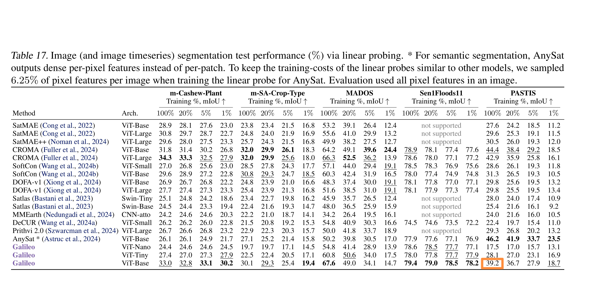

# 阶段成果报告：Galileo 冻结特征上的 DPT 解码器实验

日期：2026-07-11

分支：`feat/paper-aligned-pastis-input`

评估代码版本：`f7964fa`

任务：PASTIS 19 类作物语义分割

## 1. 阶段结论

本阶段完成了 Galileo 论文输入协议对齐、共享特征缓存、single-layer DPT baseline、多层 DPT 解码器训练，以及 fold5 test 集完整评估。

核心结果如下：

| 方法 | 使用的 Galileo 特征 | Test loss | Test mIoU | 相对论文 39.2% |
| --- | --- | ---: | ---: | ---: |
| Galileo ViT-Base linear probe（论文参考） | 论文线性探测协议 | - | 39.20% | - |
| Single-layer DPT（本项目 baseline） | final `features` | 1.03058 | **45.78%** | **+6.58 pp** |
| Multi-layer DPT | layers 3/6/9/12 | **1.00184** | **46.32%** | **+7.12 pp** |

在当前实验设置下，多层 DPT 比单层 DPT 提高 **0.54 个百分点 mIoU**，同时 test loss 降低 0.02874。结果支持“Galileo 中间层信息对 PASTIS 分割有帮助”，但增益目前较小，且不同类别上的变化并不一致。

需要强调：论文中的 39.2% 是 Galileo ViT-Base 在 Table 17 中的 **linear probing** 结果；本项目训练的是具有卷积细化和上采样能力的 DPT-style decoder。因此超过 39.2% 可以说明更强 decoder 在当前协议下有效，但不能解释为同容量、同训练策略下对论文线性 probe 的严格复现或公平替代。

## 2. 论文参考基线

下图橙框标出 Galileo ViT-Base 在 PASTIS 100% training data 设置下的 39.2% mIoU：



本文后续使用“论文参考基线”指代该 39.2%；使用“本项目 baseline”指代 single-layer DPT 的 45.78%。

## 3. 数据与输入协议

本轮 single-layer 和 multi-layer 实验严格共享以下设置：

| 项目 | 设置 |
| --- | --- |
| 数据集 | PASTIS Sentinel-2 time series |
| Train | folds 1/2/3，1455 个原始 patch，切分后 5820 个 tile |
| Validation | fold 4，482 个原始 patch，切分后 1928 个 tile |
| Test | fold 5，496 个原始 patch，切分后 1984 个 tile |
| 时间处理 | 2018-10 至 2019-09，按月聚合为固定 T=12 |
| 波段 | PASTIS 原生 10 个 Sentinel-2 波段 |
| 空间处理 | 每个 128×128 patch 切为 4 个不重叠 64×64 tile |
| Galileo patch size | 4，输出 16×16 spatial grid |
| 类别 | 有效类别 0..18，共 19 类 |
| Void | 原始 label 19 映射为 -1，在 loss 和 mIoU 中忽略 |
| 归一化 | `galileo_norm_no_clip`，std multiplier = 2.0 |
| Encoder | Galileo ViT-Base，完全冻结 |

共享缓存目录：

```text
data/cache/galileo-base-patch8/monthly12_tile64_patch4_hl3-6-9-12_train
data/cache/galileo-base-patch8/monthly12_tile64_patch4_hl3-6-9-12_val
data/cache/galileo-base-patch8/monthly12_tile64_patch4_hl3-6-9-12_test
```

test 缓存包含 1984 个 `.npz`，总大小约 6.74GB。两个 decoder 使用完全相同的缓存和 target；训练及测试时都不重新运行 encoder。

## 4. 模型与训练设置

### 4.1 Single-Layer DPT

```text
Galileo final feature [B, 768, 16, 16]
  -> 1×1 projection to 256 channels
  -> 3 residual convolution blocks
  -> bilinear upsampling to 64×64
  -> smoothing + 19-class head
```

可训练参数：4,924,691（约 4.92M）。

### 4.2 Multi-Layer DPT

```text
Galileo layers 3/6/9/12
  -> each [B, 768, 16, 16]
  -> independent 1×1 projections
  -> deep-to-shallow additive residual fusion
  -> 3 residual convolution blocks
  -> bilinear upsampling to 64×64
  -> smoothing + 19-class head
```

可训练参数：9,058,067（约 9.06M），约为 single-layer DPT 的 1.84 倍。

### 4.3 共同训练超参数

| 参数 | 值 |
| --- | --- |
| Seed | 42 |
| Batch size | 16 |
| DataLoader workers | 2 |
| Epochs | 100 |
| Loss | CE + 0.5 × Dice |
| Optimizer | Prodigy |
| 配置学习率 | 1.0 |
| Weight decay | 0.1，decoupled |
| Scheduler | none |
| AMP | false |
| Checkpoint 规则 | 最低 `val_loss` 保存为 `best.pt` |

TensorBoard 中记录的学习率从 epoch 1 到 100 均为 1.0。Prodigy 会在优化器内部进行自适应缩放，因此这里记录的是配置学习率，不等同于普通 SGD/Adam 的实际步长解释。

硬件为 NVIDIA GeForce RTX 4060 Laptop GPU（8188MiB）。TensorBoard 记录的 PyTorch 最大 allocated memory 分别约为：

| 模型 | 最大 allocated GPU memory | 训练日志跨度 |
| --- | ---: | ---: |
| Single-layer DPT | 697.8MiB | 3.24h |
| Multi-layer DPT | 880.0MiB | 3.94h |

两组实验均记录 100 epochs、36,400 个训练 step。多层 DPT 的日志时间约增加 21.7%。该时间是 event 文件首末时间差，属于近似训练耗时。

## 5. 训练日志分析

### 5.1 Single-Layer DPT

| 位置 | Epoch | Train loss | Val loss | Val mIoU |
| --- | ---: | ---: | ---: | ---: |
| 初始 | 1 | 1.44119 | 1.18263 | 29.72% |
| 最低 val loss / 实际 checkpoint | 25 | 0.80624 | **0.97807** | 47.07% |
| 最高 val mIoU | 47 | 0.74128 | 0.99477 | **47.15%** |
| 训练结束 | 100 | 0.65189 | 1.09893 | 44.16% |

观察：

- epoch 25 后 train loss 继续下降，但 val loss 总体回升，已经出现过拟合。
- 最高 val mIoU 出现在 epoch 47，但只比 epoch 25 高 0.08 个百分点。
- epoch 100 的 val mIoU 比峰值下降约 2.99 个百分点，因此使用最后一轮权重明显不合适。

### 5.2 Multi-Layer DPT

| 位置 | Epoch | Train loss | Val loss | Val mIoU |
| --- | ---: | ---: | ---: | ---: |
| 初始 | 1 | 1.45744 | 1.26021 | 28.39% |
| 最低 val loss / 实际 checkpoint | 11 | 0.86394 | **0.95653** | 47.95% |
| 最高 val mIoU | 22 | 0.76417 | 0.96571 | **49.34%** |
| 训练结束 | 100 | 0.50498 | 1.18829 | 42.54% |

观察：

- 多层模型更早达到最低 val loss，并在 epoch 22 达到最高 val mIoU。
- epoch 22 的 val mIoU 比实际保存 checkpoint 的 epoch 11 高 1.39 个百分点。
- 由于 Trainer 只保存最低 val loss，epoch 22 权重没有保留，无法对其进行 test 评估。
- epoch 100 的 train loss 已降到 0.50498，但 val loss 升到 1.18829，val mIoU 比峰值下降约 6.80 个百分点；多层模型的过拟合比单层更明显。

### 5.3 Checkpoint 选择问题

本轮 test 使用的权重如下：

| 模型 | Checkpoint epoch | 选择依据 | Val mIoU at checkpoint |
| --- | ---: | --- | ---: |
| Single-layer DPT | 25 | 最低 val loss | 47.07% |
| Multi-layer DPT | 11 | 最低 val loss | 47.95% |

这保证了本轮两个 test 结果都遵循训练前既定的同一 checkpoint 规则，没有根据 test 表现选模型。但对以 mIoU 为主指标的语义分割实验，后续应同时保存 `best_val_loss.pt` 和 `best_val_miou.pt`，并预先规定最终报告使用哪一个。

## 6. Fold5 Test 结果

完整 test 集包含 1984 个 tile，batch size 为 16，共评估 124 个 batch。

### 6.1 总体结果

| 模型 | Checkpoint | Test loss | Test mIoU | 相对 single-layer | 相对论文 39.2% |
| --- | ---: | ---: | ---: | ---: | ---: |
| Single-layer DPT | epoch 25 | 1.03058 | 45.78% | - | +6.58 pp |
| Multi-layer DPT | epoch 11 | **1.00184** | **46.32%** | **+0.54 pp** | **+7.12 pp** |

多层模型在验证集 checkpoint 和 test 集上都优于单层模型，因此方向上具有一致性。不过 test 增益仅为 0.54 个百分点，在只有一个 seed 的情况下还不能判断该增益是否稳定，需要多 seed 重复实验。

### 6.2 逐类 IoU

当前评估代码按 class ID 0..18 输出，没有在仓库内维护类别名称映射，因此本报告保留 class ID，避免错误对应作物名称。

| Class ID | Single-layer | Multi-layer | Multi - Single |
| ---: | ---: | ---: | ---: |
| 0 | 72.45% | 72.00% | -0.45 pp |
| 1 | 60.18% | 61.39% | +1.21 pp |
| 2 | 73.95% | 75.12% | +1.18 pp |
| 3 | 75.49% | 76.15% | +0.65 pp |
| 4 | 46.21% | 46.78% | +0.57 pp |
| 5 | 81.27% | 79.01% | -2.26 pp |
| 6 | 30.22% | 31.52% | +1.30 pp |
| 7 | 37.24% | 35.01% | -2.23 pp |
| 8 | 51.42% | 51.53% | +0.10 pp |
| 9 | 69.36% | 71.98% | +2.62 pp |
| 10 | 13.26% | 20.60% | **+7.34 pp** |
| 11 | 49.68% | 49.64% | -0.04 pp |
| 12 | 24.44% | 25.04% | +0.60 pp |
| 13 | 32.66% | 31.64% | -1.01 pp |
| 14 | 25.52% | 22.98% | **-2.54 pp** |
| 15 | 54.99% | 57.69% | +2.71 pp |
| 16 | 39.03% | 37.43% | -1.60 pp |
| 17 | 19.38% | 19.25% | -0.14 pp |
| 18 | 13.05% | 15.34% | +2.29 pp |

多层特征带来的收益主要集中在 class 10、15、9、18；class 14、5、7、16 则出现下降。这说明多层融合不是对所有类别统一改善，后续需要结合类别频率、混淆矩阵和可视化判断原因。

## 7. 当前成果与解释

1. **输入和评测链路已经跑通。** 从原始 PASTIS 到论文对齐输入、Galileo 特征缓存、decoder 训练、fold5 测试形成了完整可复现流程。
2. **Single-layer DPT 已成为有效 baseline。** 其 test mIoU 为 45.78%，在当前协议下明显高于论文线性探测参考值 39.2%。
3. **多层特征存在正收益。** Multi-layer DPT 达到 46.32%，比单层高 0.54 个百分点，但参数量增加约 84%，训练时间增加约 22%。
4. **100 epochs 明显过长。** 两个模型后半程都出现 train loss 下降、val loss 上升和 val mIoU 回落，尤其多层模型更严重。
5. **保存策略与论文主指标错位。** 当前按 val loss 保存，而主要汇报指标是 mIoU；多层模型因此没有保留 val mIoU 最高的 epoch 22。

## 8. 局限性

- 当前每个 decoder 只运行了 seed 42，无法给出均值、标准差或显著性判断。
- 39.2% 来自论文 linear probing；本项目 DPT decoder 参数更多，比较反映的是完整下游方案差异，不是纯 encoder 表征能力差异。
- 论文还包含 normalization、学习率搜索和多次运行；本轮使用固定的公开候选配置，没有复现完整 sweep。
- 当前只保存最低 val loss checkpoint，无法补测历史最高 val mIoU checkpoint。
- 多层 DPT 参数量约为单层的 1.84 倍，当前结果还没有控制 decoder 参数量。
- 逐类分析只有 class ID，尚未加入官方类别名称、类别像素频率和混淆矩阵。
- fold5 test 已用于本阶段最终汇报，后续不应根据这些 test 结果反复调整超参数。

## 9. 下一步建议

按优先级建议：

1. 修改 Trainer，同时保存 `best_val_loss.pt` 与 `best_val_miou.pt`，加入以 val mIoU 为依据的 early stopping。
2. 将最大 epoch 降到约 40，并设置 patience 10～15；具体规则应在下一轮运行前固定。
3. 对 single-layer 和 multi-layer 使用至少 3 个相同 seeds，报告 test mIoU 的均值和标准差。
4. 训练已经实现的 UPerNet-style decoder，并保持完全相同的缓存、loss、batch size 和 seed 列表。
5. 增加 confusion matrix、类别频率和定性预测图，重点检查 class 10 的改善以及 class 14/5/7 的退化。
6. 若需要更严格的 decoder 对比，增加参数量匹配实验，避免把模型容量收益误认为融合结构收益。

## 10. 复现命令

Single-layer DPT test：

```powershell
conda run -n presl python -B scripts/eval_cached.py --config configs/galileo_single_layer_dpt_shared.yaml --checkpoint checkpoints/galileo_single_layer_dpt_shared_paper_input_bs16_cached/best.pt --split test
```

Multi-layer DPT test：

```powershell
conda run -n presl python -B scripts/eval_cached.py --config configs/galileo_multi_layer_dpt_shared.yaml --checkpoint checkpoints/galileo_multi_layer_dpt_shared_paper_input_bs16_cached/best.pt --split test
```

训练日志：

```text
logs/galileo_single_layer_dpt_shared_paper_input_bs16_cached/
logs/galileo_multi_layer_dpt_shared_paper_input_bs16_cached/
```

测试 checkpoint：

```text
checkpoints/galileo_single_layer_dpt_shared_paper_input_bs16_cached/best.pt
checkpoints/galileo_multi_layer_dpt_shared_paper_input_bs16_cached/best.pt
```

测试结果原始输出：

```text
single-layer: test_loss=1.03058, test_miou=0.45779
multi-layer:  test_loss=1.00184, test_miou=0.46322
```
